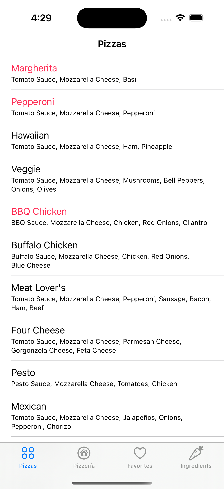
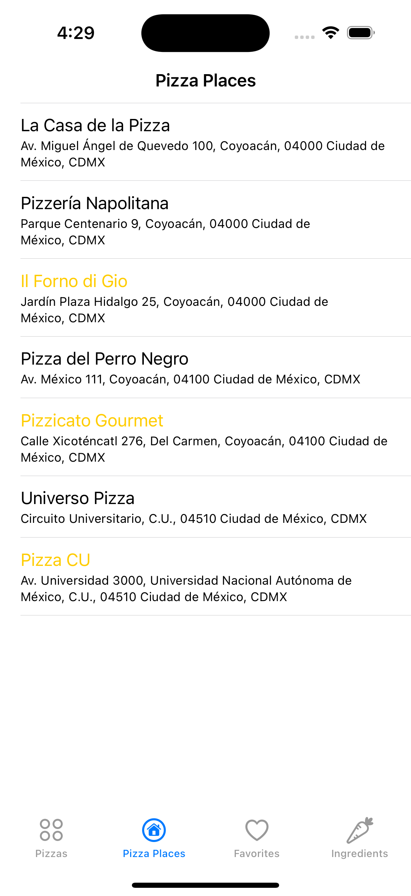
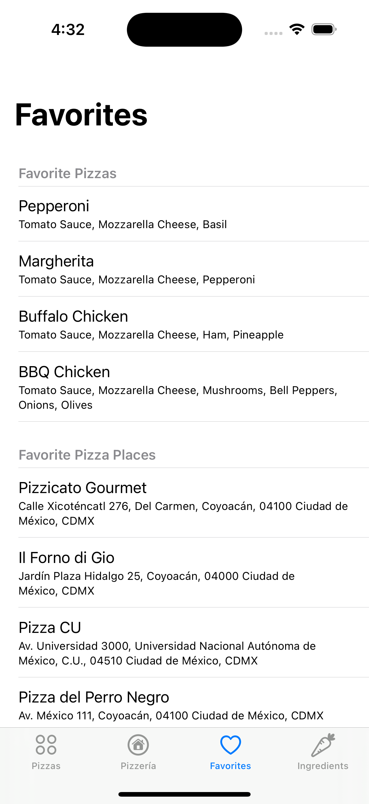
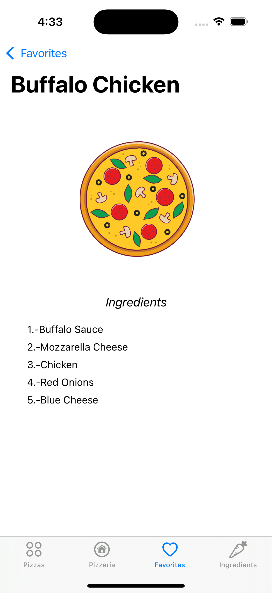
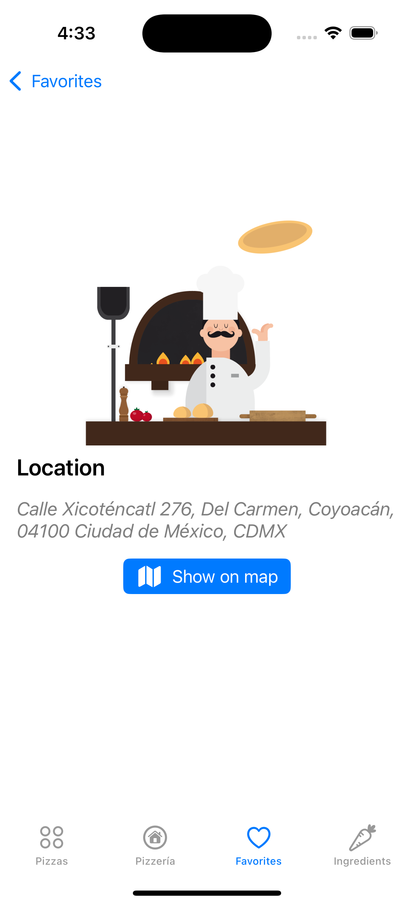
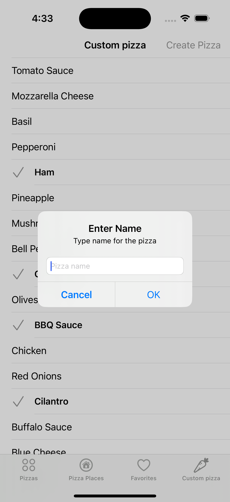

# Pizzadiction 🍕

The **Pizzaddiction** is an iOS application built using **UIKit** and programmatic views. It allows users to explore different pizzas and pizzerias, manage their favorites, and even create custom pizzas. The app features interactive animations, a map view for pizzerias, and a favorites list that persists across app sessions.

## 📌 Features

### 🍕 1. Pizza List
- Browse a variety of pizzas sourced from a JSON file.
- Use swipe actions to add or remove pizzas from favorites.
- Tap on a pizza to view its details, including:
  - An animated header.
  - A list of ingredients for the selected pizza.

### 🏠 2. Pizzeria List
- View a list of pizzerias sourced from a JSON file.
- Use swipe actions to add or remove pizzerias from favorites.
- Tap on a pizzeria to access details, such as:
  - Name and location.
  - If coordinates are available, open a **map view**:
    - A modal map displays the pizzeria’s location.
    - A pin marks the pizzeria, and the user's current location is also shown.
    - A button provides directions from the user's location to the pizzeria.

### ⭐ 3. Favorites
- Access a combined list of favorite pizzas and pizzerias.
- Tap on any item to view its corresponding details.

### 🛠️ 4. Custom Pizza Creator
- Explore a list of ingredients sourced from a JSON file.
- Select multiple ingredients to design a custom pizza.
- Tap a button to create a new pizza:
  - Enter a name for the custom pizza.
  - The new pizza is saved and added to the list.
  - The selected ingredients reset after creation.

### 🔄 5. Persistent Favorites
- Favorites are saved and persist across app launches, ensuring user preferences remain intact.

## 🛠️ Technologies Used
- **UIKit** – User interface and programmatic views.
- **JSON** – Storing and retrieving data on pizzas, pizzerias, and ingredients.
- **CoreLocation** – Accessing the user's location.
- **MapKit** – Displaying maps and marking pizzeria locations.
- **Lottie** – Adding smooth UI animations.

## 🚀 Installation

1. Clone the repository:
   ```bash
   git clone https://github.com/MauricioART/Pizzeriaddiction.git
   ```
2. Open the project in **Xcode**.
3. Install any dependencies (if using CocoaPods or Swift Package Manager).
4. Run the app on a **simulator** or **physical device**.

## 📸 Screenshots
Check out some screenshots of the app in action:

### 🍕 Pizza List View


### 🏠 Pizzeria Detail View with Map Integration


### 🛠️ Create Custom Pizza Screen



### 🛠️ Create Custom Pizza Screen



### 🛠️ Create Custom Pizza Screen



### 🛠️ Create Custom Pizza Screen


### 🛠️ Create Custom Pizza Screen


## 🤝 Contribution
Want to contribute? Follow these steps:

1. Fork the repository.
2. Create a new branch:
   ```bash
   git checkout -b feature/new-feature
   ```
3. Make changes and commit them:
   ```bash
   git commit -am 'Add new feature'
   ```
4. Push the branch:
   ```bash
   git push origin feature/new-feature
   ```
5. Submit a **Pull Request**.

## 📜 License
This project is licensed under the **MIT License** – see the [LICENSE](LICENSE) file for details.

## 🎓 Project Context
This project was developed as part of the **iOS Application Development Module** for the **Diploma in Mobile Application Development** at the **Faculty of Engineering, UNAM (National Autonomous University of Mexico).**


